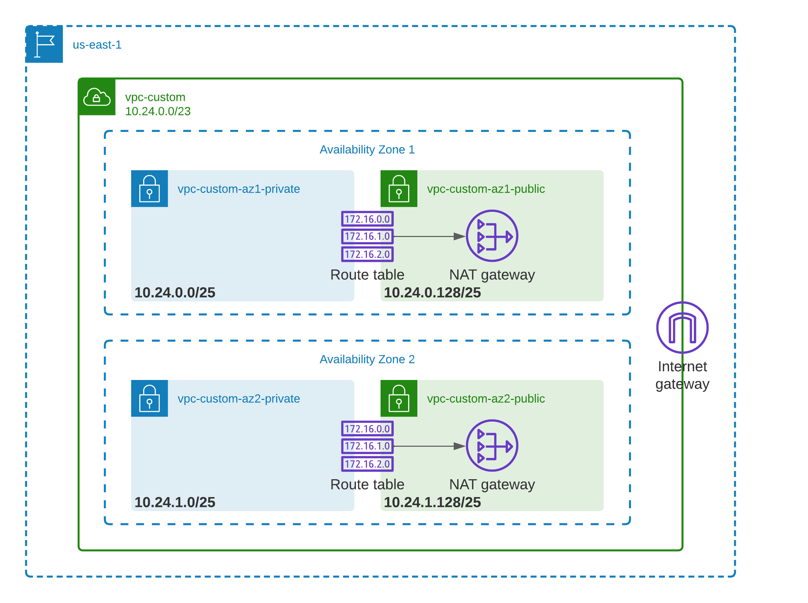

# cdk-vpc-template

AWS CDK application written in Python for a VPC.  Parameterized to be customizable.

## Introduction

This AWS CDK application deploys a VPC with 2 availability zones with one public and one private subnet per availability zone.  The following diagram describes the structure.



One NAT Gateway is created per availability zone to allow for outbound internet traffic from the private subnets.

## Prerequisites

The following lists the required prerequisites for this application:

* AWS Account
* cdk ([instructions here](https://docs.aws.amazon.com/cdk/v2/guide/getting_started.html))
* Python 3.7 or above

In addition, command line access to the AWS account should be configured.  Commandline access must be enabled and an access key to be available.  This can be enabled through the AWS console.

Once that is set up, download `awscli` and configure access by running

```
aws configure
```

and following the prompts.

## Installation

Run the following to create a Python virtual environment.

```
python3 -m venv .venv
```

Then, activate the environment with the following (on Mac or Linux).

```
source .venv/bin/activate
```

Then, install the Python packages with the following.

```
pip3 install -r requirements.txt
```

To install the test dependencies and run tests, run the following two commands.

```
pip3 install -r requirements-dev.txt
pytest .
```

## Deployment

To deploy the application, cdk must first be bootstraped for the region in the AWS account.  To do so, run the following.

```
cdk bootstrap
```

Then, run the following from the root directory of the application with the Python virtual environment activated.

```
cdk deploy \
    --context account=<ACCOUNT ID> \
    --context region=<REGION>
```

Replace `<ACCOUNT ID>` and `<REGION>` with the appropriate parameters.